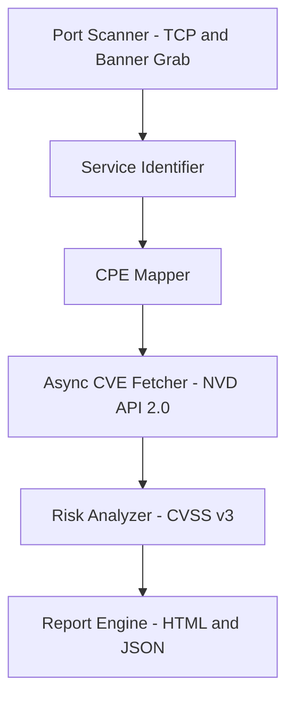

# 🛡️ Network Vulnerability Manager (NVM)


**NVM (Network Vulnerability Manager)** is an advanced, asynchronous, NVD-powered vulnerability assessment engine designed for security teams, pentesters, and enterprises requiring **accurate**, **consistent**, and **audit-ready** vulnerability intelligence.

NVM integrates **high-speed port scanning**, **banner fingerprinting**, **CPE mapping**, **CVE correlation**, and **risk classification** into a single automated workflow.

---

## 🚀 Features

- ⚡ Threaded high-speed port scanner  
- 🧩 Smart banner grabber
- 🎯 Accurate CPE mapping with version extraction  
- 🔎 Asynchronous CVE lookup (NVD API 2.0 + retries)  
- 📦 Local caching to avoid rate limits  
- 📊 CVSS v3 risk scoring  
- 🖥️ Professional HTML dashboard reports (accordion UI + search + copy buttons)  
- 📄 JSON reports for integrations  
- 🔄 Consistent multi-run output (no silent failures)  
- 🧰 Lightweight, modular, and open-source  

---

## 🧩 Architecture Overview




---

## 📂 Project Structure

```
.
├── config/
│   └── settings.json
├── core/
│   ├── analyzer.py
│   ├── cve_lookup.py
│   ├── identifier.py
│   ├── scanner.py
│   └── utils.py
├── data/
│   └── cve_cache.json
├── reports/
│   ├── generate_html.py
│   ├── generate_json.py
│   └── NVM-Report-<target>.html / .json
├── docs/
│   └── README.md
├── nvm.py
└── requirements.txt
```

---

## ⚙️ Installation

### 1. Clone the repository

```bash
git clone https://github.com/<your-user>/Network-Vulnerability-Manager.git
cd Network-Vulnerability-Manager
```

### 2. Install dependencies

```bash
pip install -r requirements.txt
```

### 3. (Optional) Add your NVD API Key


**Linux/macOS**

```bash
export NVD_API_KEY="your-api-key"
```

**Windows PowerShell**

```powershell
setx NVD_API_KEY "your-api-key"
```

---

## 🧪 Usage Examples

### Basic scan

```bash
python nvm.py -t 192.168.1.10
```

### Scan with custom ports

```bash
python nvm.py -t 192.168.1.10 -p 1-2000
```

### Generate HTML report

```bash
python nvm.py -t 10.10.10.5 -p 1-1000 --html
```

### Generate JSON report

```bash
python nvm.py -t 45.33.32.156 -p 1-1000 --json
```

### High-performance threaded scan

```bash
python nvm.py -t 172.16.0.2 -p 1-10000 --threads 100
```

---

## 📜 Command Reference

| Argument        | Flags            | Description                           | Default  |
| --------------- | ---------------- | ------------------------------------- | -------- |
| **Target**      | `-t`, `--target` | IP address to scan                    | required |
| **Ports**       | `-p`, `--ports`  | Port range (`1-1000`, `80,443`, etc.) | `1-1000` |
| **Threads**     | `--threads`      | Parallel connections                  | `50`     |
| **HTML Report** | `--html`         | Generates styled HTML dashboard       | False    |
| **JSON Report** | `--json`         | Generates JSON output                 | False    |

---

## 📄 Sample JSON Output

```json
{
  "scan_date": "2025-11-19 18:22:11",
  "target": "45.33.32.156",
  "overall_risk": "CRITICAL",
  "results": {
    "80": {
      "service": "banner_grabbed",
      "version": "Apache/2.4.7",
      "cpe": "cpe:2.3:a:apache:http_server:2.4.7",
      "risk": "CRITICAL",
      "vulnerabilities": []
    },
    "22": {
      "service": "banner_grabbed",
      "version": "SSH-2.0-OpenSSH_6.6.1p1",
      "cpe": "cpe:2.3:a:openbsd:openssh:6.6.1p1",
      "risk": "HIGH",
      "vulnerabilities": []
    }
  }
}
```

---

## 🖥️ HTML Report (Example Preview)


---

## 🔥 Why NVM is Reliable

* ✔ No silent failures (retry logic)
* ✔ Accurate CPE & version extraction
* ✔ Asynchronous NVD API calls
* ✔ Local caching
* ✔ Repeatable results across runs

---
 

---

## ⚠️ Legal / Pentesting Disclaimer

Use NVM **only** on:

* systems you own  
* systems you administer  
* systems where you have **explicit permission**  

Unauthorized scanning is illegal.  
The authors assume **no responsibility** for misuse.

---
## 👨‍💻 *Author*
📧 Reach out via [GitHub](https://github.com/Alexander-50) for research collaborations.

**Alexander P.B.**  
*Cybersecurity Researcher & Penetration Tester*  
*Red Team & IoT Security Specialist*  


---

